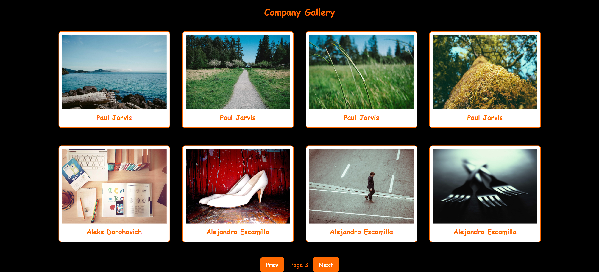

# 📸 Gallery

🔗 **Live Demo:** https://nd10gallery.netlify.app/

Gallery is a modern and responsive image gallery web application built using **React (Vite)**.  
It displays images in a clean card layout with pagination and a smooth user experience.

---

## 🚀 Features

- ⚡ Fast performance using Vite  
- 🖼️ Image gallery with card layout  
- 🎨 Clean and attractive UI  
- 📄 Pagination (Prev / Next)  
- 📱 Fully responsive design  
- 🔄 Component-based architecture  

---

## 🛠️ Tech Stack

- **Frontend:** React.js  
- **Build Tool:** Vite  
- **Styling:** CSS  
- **Deployment:** Netlify  

---

## 📂 Project Structure
Gallery/
│

├── src/

│ ├── App.jsx

│ ├── main.jsx

│ ├── index.css

│
├── index.html

├── package.json

├── vite.config.js

└── README.md

---

## 📦 Build for Production
npm run build

---

## 🌍 Deployment

Deployed using **Netlify** for fast and reliable hosting.

---

## 📸 Screenshot

---

## 👩‍💻 Author

**Kumari Nidhi**

---
